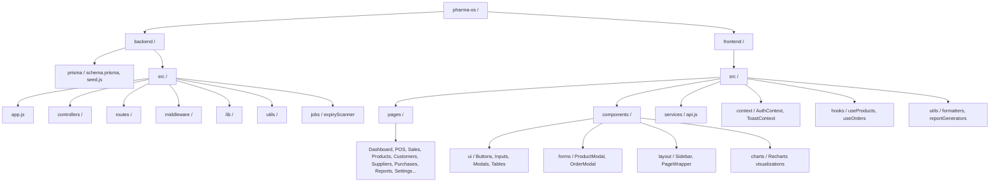

# PharmaOS — Pharmacy Internal Management System

> **The operational backbone of the modern pharmacy.**

PharmaOS is a comprehensive internal management system designed for pharmacy operations. It provides inventory management, order tracking, expiry detection, analytics, and intelligent prompt-to-action capabilities.

## 🚀 Live Demo

🔗 **[Live Application](https://pharmaos-app.netlify.app)**

### Demo Credentials

All demo users share the same password: **`pharma123`**

| Role | Email |
|------|-------|
| **Super Admin** | `superadmin1@pharmaos.com` |
| **Admin** | `admin1@pharmaos.com` |
| **Finance** | `finance@pharmaos.com` |
| **Manager** | `manager@pharmaos.com` |
| **Pharmacist** | `pharmacist1@pharmaos.com` |

📖 [Full Demo Credentials](docs/DEMO_CREDENTIALS.md)

## 📋 Features

- **Point of Sale (POS)** — Fast checkout interface with customer search, quick actions, and receipt printing
- **Sales Management** — Track all sales with dedicated list view and filtering
- **Inventory Management** — Full CRUD operations with status filtering (current, expired, near-expiry, out-of-stock)
- **Product Management** — Manage medicines with generic names, batch numbers, pricing, and expiry dates
- **Order Lifecycle** — Complete order tracking from pending to completion with atomic inventory updates
- **Purchase Orders** — Create and manage supplier purchase orders with full tracking
- **Customer & Supplier Management** — Full CRUD with search and inline forms
- **Financial Tracking** — Income, expenses, tax, and due list management
- **Professional Reports** — Export high-quality **PDF** and **CSV** business analytics
- **Automated Expiry Detection** — Daily scanning engine with real-time alerts
- **Role-Based Access Control** — Granular permissions for Super Admin, Admin, Manager, Pharmacist, Finance, Dispatch, Rider, and Receiving Bay roles
- **Dual-Token Session Management** — Secure JWT with automatic token refresh
- **Intelligent Search** — Dashboard search for instant data retrieval
- **Transaction Audit** — Real-time tracking of every financial change
- **Quick-Edit Modals** — View and Edit modes for rapid updates

## 📂 Project Structure



PharmaOS is architected as a clean Monorepo-style project with clear separation between the API (Backend) and the Interface (Frontend).

### 🖥️ Backend (/backend)
Built with **Express**, **Prisma**, and **PostgreSQL**.
- `prisma/` — The database heartbeat. Contains the `schema.prisma` definition and the `seed.js` script.
- `src/`
  - `app.js` — The core Express application configuration and middleware pipeline.
  - `controllers/` — The business logic layer. Handlers for products, orders, imports, and **reporting**.
  - `routes/` — The API routing layer. Defines endpoints and maps them to controllers.
  - `middleware/` — Security, JWT authentication, Zod validation, and error handling.
  - `utils/` — Shared helpers for response formatting, logging, and alert management.
  - `jobs/` — Scheduled tasks, specifically the **Daily Expiry Scanner**.

### 🎨 Frontend (/frontend)
Built with **React 18**, **Vite**, and **Tailwind CSS**.
- `src/`
  - `pages/` — The high-level page views:
    - **Dashboard** — Analytics, KPIs, charts, and quick actions
    - **Sales** — POSView (Point of Sale) and SalesList
    - **Products** — Product management with inline forms
    - **StockList** — Inventory views (current, expired, low, out-of-stock)
    - **Customers & Suppliers** — Full CRUD with search
    - **Purchases** — Purchase order management
    - **Reports** — PDF/CSV export for inventory, expiry, sales
    - **Financial** — Incomes, Expenses, Tax, DueList
    - **Settings** — System configuration
  - `components/`
    - `ui/` — Atomic, reusable UI components (Buttons, Inputs, Modals, Tables, Badges)
    - `forms/` — Complex, state-managed forms like `ProductModal` and `OrderModal`
    - `layout/` — Structural components like `Sidebar` and `PageWrapper`
    - `charts/` — Data visualization using Recharts
    - `templates/` — ListTemplate, FormTemplate for consistent page layouts
  - `context/` — Global state management for Authentication (`AuthContext`) and UI Toasts (`ToastContext`)
  - `services/` — The API communication layer (Axios instances)
  - `utils/` — Formatting helpers for currency, dates, and **PDF Report Generators**
  - `hooks/` — Custom React hooks for standardized data fetching

---

## 🛠️ Tech Stack

### Frontend
- React 18 + Vite
- Tailwind CSS + PostCSS
- React Router v6
- Recharts (Visualization)
- **jsPDF + AutoTable** (Reporting)
- Lucide React (Icons)
- Axios
- Framer Motion (Animations)
- html2canvas (Screenshot export)

### Backend
- Node.js + Express
- **Prisma ORM**
- PostgreSQL
- node-cron (Scheduling)
- Multer (CSV/file handling)
- Zod (Validation schema)
- JWT (Authentication with refresh tokens)
- bcrypt (Password hashing)
- PDFKit (Report generation)

---

## 📦 Local Setup

### Prerequisites
- Node.js 18+
- PostgreSQL database
- npm or yarn

### Backend Setup
```bash
cd backend
npm install

# Create .env file from .env.example
cp .env.example .env

# Run database migrations
npx prisma migrate dev --name init

# Seed the database with sample data
npm run seed

# Start development server
npm run dev
```

### Frontend Setup
```bash
cd frontend
npm install

# Create .env file from .env.example
cp .env.example .env

# Start development server
npm run dev
```

---

## 📚 Documentation & Guides

For deeper technical dives, refer to our specialized guides in the [`docs/`](docs/) folder:

- [Deployment Guide](docs/DEPLOYMENT.md) — Production rollout instructions (Render + Netlify)
- [Demo Credentials](docs/DEMO_CREDENTIALS.md) — All demo user logins
- [Design Specification](docs/design.md) — UI/UX principles and color tokens
- [Session Management](docs/SESSION_MANAGEMENT.md) — Dual-token JWT with auto-refresh
- [Auth Guide](docs/AUTH_GUIDE.md) — Authentication and role-based access control
- [Mobile Responsiveness](docs/MOBILE_RESPONSIVENESS.md) — Responsive design guidelines
- [Progress Tracker](docs/PROGRESS_TRACKER.md) — Feature development history
- [Status](docs/STATUS.md) — Current project status

---

## 👥 Team

**Tech Vanguard**
- [Victor Chogo](https://github.com/Skillyme-Cohort-1) — Full-Stack Developer
- Daisy Bless
- Mukhongo Vivian
- Kioko Julius
- Paul Gitaranga
- Stephen Oduor
  

## 📄 License

Internal project for demonstration purposes.
